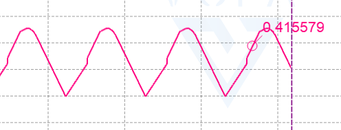
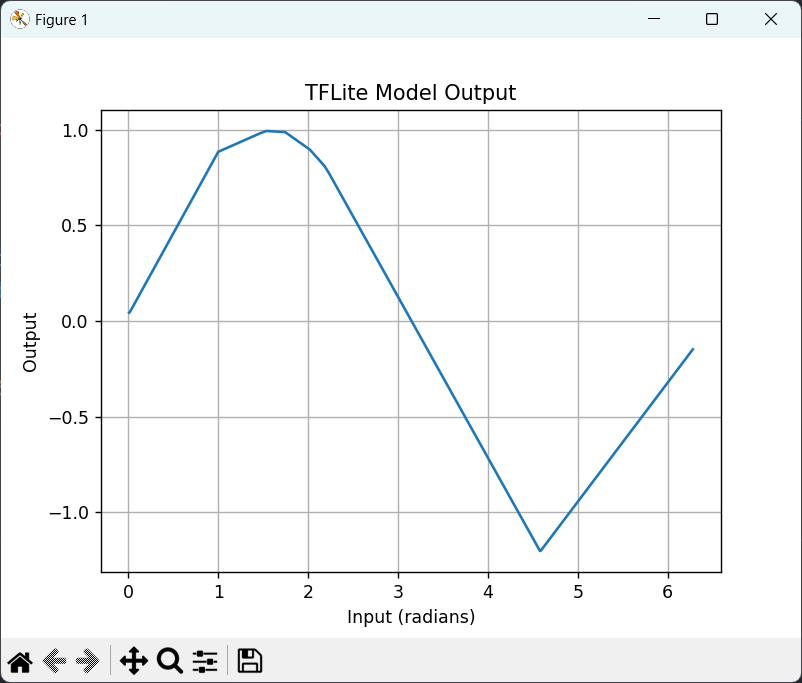

应用场景：nano_edge_ai（异常检测，状态检测，分类），cube_ai（视觉与音频，分类）

### 1.数据采集，保存为csv格式

### 2.数据预处理和数据标注和归一化处理（最大最小归一化，均值归一化）

### 3.部署

##### 效果:网络模型为1输入，1输出，的正弦波，通过推理得到

~~~c
#include "stdio.h"

#include "sin_model.h"
#include "sin_model_data.h"
#include "ai_datatypes_defines.h"
#include "ai_platform.h"

ai_handle network;
ai_buffer * ai_input;
ai_buffer * ai_output;
// 定义输入和输出数
float input_data[100];
static float output_data;
main() {
    
  for(int i=0; i<100; i++) {
  	input_data[i] = 0.01*i;
  }
  ai_u8 activations[AI_SIN_MODEL_DATA_ACTIVATIONS_SIZE];
  const ai_handle act_addr[] = { activations };
  ai_sin_model_create_and_init(&network,act_addr, NULL);
  ai_input = ai_sin_model_inputs_get(network, NULL);
  ai_output = ai_sin_model_outputs_get(network, NULL);
  ai_output->data = AI_HANDLE_PTR(&output_data);
  HAL_UART_Transmit(&huart1, "hello1", 6, 1000);
  while (1)
  {
	  for(int j=0; j<100; j++) {
		  ai_input->data = AI_HANDLE_PTR(&input_data[j]);
		  int batch = ai_sin_model_run(network, ai_input, ai_output);
		  if(batch != 1) {
			  HAL_UART_Transmit(&huart1, "error", 5, 1000);
			  HAL_Delay(1500);
		  }
		  char buf[50] = {0};
		  sprintf(buf,"out_is:%f\r\n",output_data);
		  HAL_UART_Transmit(&huart1, buf, 50, 1000);
	  }
    
}
~~~

##### 用python在计算机验证

~~~python
import numpy as np
import matplotlib.pyplot as plt
import tensorflow as tf

# 加载 TFLite 模型
interpreter = tf.lite.Interpreter(model_path='C:\\Users\\fan\Desktop\\tflite-micro-main\\tensorflow\\lite\\micro\\examples\\hello_world\\tmp\\hello_world_models\\hello_world_float.tflite')
interpreter.allocate_tensors()

# 获取输入和输出张量的信息
input_details = interpreter.get_input_details()
output_details = interpreter.get_output_details()

# 生成输入数据
input_data = np.arange(0.01, 2 * np.pi, 0.01, dtype=np.float32)

# 存储输出数据
output_data = []

# 遍历输入数据并进行推理
for value in input_data:
    # 设置输入数据
    interpreter.set_tensor(input_details[0]['index'], np.array([[value]]))
    
    # 运行推理
    interpreter.invoke()
    
    # 获取输出数据
    output = interpreter.get_tensor(output_details[0]['index'])
    output_data.append(output[0][0])  # 假设输出是二维数组

# 将输出数据转换为 NumPy 数组
output_data = np.array(output_data)

# 绘图
plt.plot(input_data, output_data)
plt.title('TFLite Model Output')
plt.xlabel('Input (radians)')
plt.ylabel('Output')
plt.grid()
plt.show()

~~~

