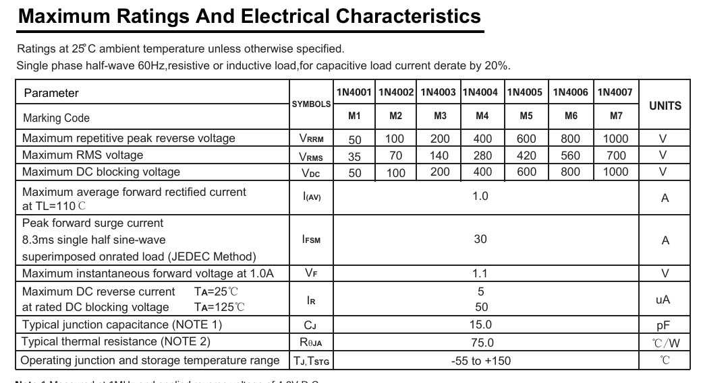
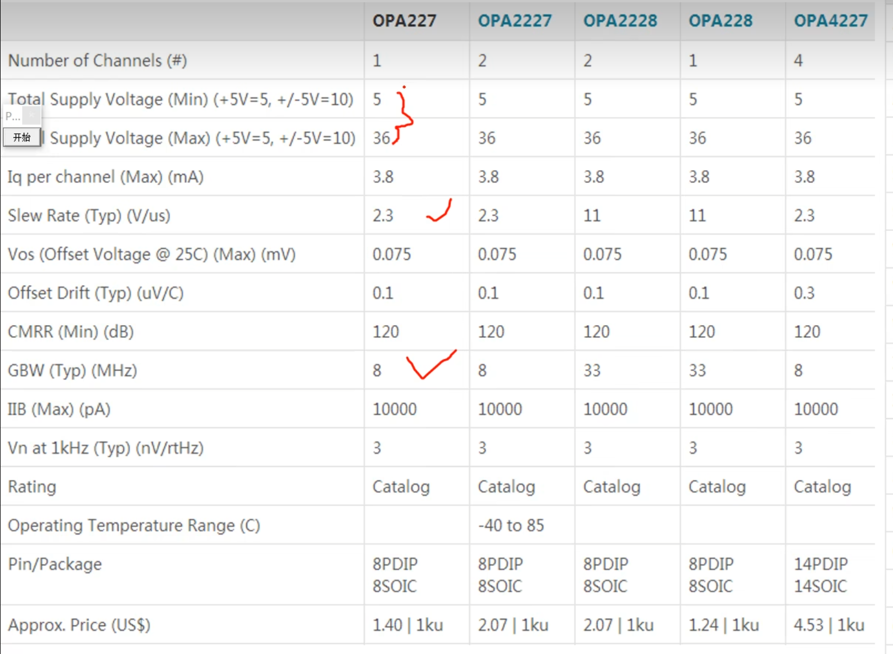

### 1.电解电容和钽电容

 1.1构造（电解电容有贴片也有直插），体积（电解电容>钽电容），容值（电解电容<钽电容），钽电容

1.2耐压（电解电容几百v>钽电容20v以内）

1.3频率特性（电解电容低频响应好1k以内<钽电容高低都适用）

1.4ESR（等效串联电阻）（电解电容>钽电容）

1.5温度特性（电解电容高于105，钽电容耐高温）->焊接

1.6价格（电解电容<钽电容）

### 2.阻容串联电路

### 3.二极管

### 4.整流二极管

4.1低频整流（电流：1N4000:1A->1N5400:1A-3A）

4.2高频整流（）

### 5.三极管

5.1双极性晶体管（电流控制电流）

5.2场效应管（电压控制电流）

​	5.2.1 123456789

### 6.运放

