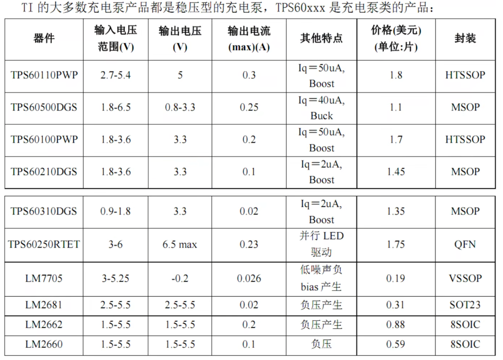

### 一.线性电源（LDO）

#### （1）DCDC线性电源的分类

1.传统压差>1.2v（双极性NPN2v,）

2.低压差<1.2（双极性PNP0.3v，NPN+PNP1v,nmos<0.5v）

#### （2）DCDC线性电源的参数

| 型号              | Vin      | Vout       | Iout（A） | 压差（V） | 噪声   | Iq静态电流 | 特点           |
| ----------------- | -------- | ---------- | --------- | --------- | ------ | ---------- | -------------- |
| LM1117-3.3        | [4.5,15] | 3.3        | 0.8       | 1.2       |        |            |                |
| TPS7A4601         | [3,36]   | [1.194,33] | 0.15      |           | 1.54uv |            |                |
| RT9013-33gb(南芯) | [,5.5]   | 3.3        | 0.5       | 0.4       | 30uv   |            |                |
| RT9068            |          |            |           |           |        | 30ua       | 输入输出防反接 |
|                   |          |            |           |           |        |            |                |
|                   |          |            |           |           |        |            |                |

### 二.开关电源(电容式)

#### （1）非稳压型电荷泵

1.负压

2.倍压

3.半压

#### （2）稳压型电荷泵

1.升压

2.降压

3.负压

max232

### 三.开关电源(电感式)

| 型号                         | Vin       | Vout       | Iout（A） | 开关频率 |      | 特点 |
| ---------------------------- | --------- | ---------- | --------- | -------- | ---- | ---- |
| TPS5450                      | [5.5,36]  | [1.22,36]  | 5         | 500k     |      | 降压 |
| MP2307                       |           |            |           |          |      | 降压 |
| TD1482A                      | [4.75,20] | [0.923,18] | 2         |          |      | 降压 |
| SY8120                       | [4.2,18]  |            | 2         | 500k     |      | 降压 |
| RT7297                       |           |            |           |          |      | 降压 |
| B628(SX1308,MT3608)          |           |            |           |          |      | 升压 |
| XL6019                       |           |            |           |          |      | 升压 |
| TPS(61040,55340,40210,61088) |           |            |           |          |      | 升压 |
| LM5122                       |           |            |           |          |      | 升压 |
| mp2359                       | [4,30]    |            | 1.2       | 1.4m     |      | 降压 |
| jw5026                       | [4.7,40]  |            | 1         | 1.1m     |      | 降压 |

### 

#### （1）DCDC开关电源的基础知识

##### 1. DCDC的基本类型
- **Buck（降压）**: 将输入电压降低到较低的输出电压。适用于需要较低电压供电的应用。
- **Boost（升压）**: 将输入电压升高到较高的输出电压。适用于需要高电压供电的应用。
- **Buck-Boost**: 结合了Buck和Boost的特性，可以在输入电压高于或低于输出电压时工作，提供更大的灵活性。

##### 2. DCDC的控制模式
- **Current Mode**: 通过控制电流来调节输出电压，具有快速响应和良好的稳定性，适合于负载变化较大的应用。
- **Voltage Mode**: 通过控制输出电压来调节电流，通常具有较简单的控制结构，但在负载变化时响应较慢。
- **Hysteretic Mode**: 通过设置上下限电压来控制开关，具有较快的动态响应，适合于对效率要求较高的应用。

#### （2）Current Mode小信号模型及环路分析
- **小信号模型**: 在小信号分析中，DCDC转换器的动态行为可以用小信号模型来描述。通过线性化控制环路，可以分析系统的增益和相位裕度。
- **环路分析**: 采用Bode图分析方法，评估系统的稳定性和响应特性。需要关注增益交叉频率和相位裕度，以确保系统在不同负载条件下的稳定性。

#### （3）DCAP/DCAP2 Mode环路分析
- **DCAP模式**: 结合了电压模式和电流模式的优点，具有较好的瞬态响应和稳定性。适用于多种负载条件。
- **DCAP2模式**: 在DCAP模式的基础上，进一步优化了控制算法，提供更好的负载瞬态响应和更低的输出电压纹波。
- **环路分析**: 通过分析DCAP/DCAP2模式下的控制环路，评估其在不同工作条件下的性能，包括负载变化和输入电压波动的影响。

#### （4）环路分析以及测量
- **环路分析**: 使用频域分析工具（如Bode分析）来评估系统的增益和相位特性，确保系统在各种条件下的稳定性。
- **测量**: 通过示波器和频谱分析仪等工具，测量输出电压、开关波形和环路响应，验证设计的性能。

#### （5）sch&pcb
- ### 设计步骤

  1. **确定需求指标**
     - 输入电压范围（Vin）
     - 输出电压（Vout）
     - 输出电流（Iout）
     - 开关频率（f_sw）
     - 允许的输出纹波（ΔVout）
  2. **第一步选电感**
     - 选择电感值（L）：
       - 对于Buck转换器，电感值可以通过以下公式计算：
         L=(Vin−Vout)⋅Voutfsw⋅ΔIL⋅Vin*L*=*f**s**w*​⋅Δ*I**L*​⋅*Vin*(*Vin*−*V**o**u**t*)⋅*V**o**u**t*​
       - 其中，ΔIL是电感电流的纹波（通常取输出电流的20%-40%）。
     - 确保电感的额定电流大于最大电流，并考虑饱和电流和直流电阻（DCR）。
  3. **第二步选电容**
     - 选择输出电容值（C）：
       - 输出电容的选择通常基于允许的输出纹波：
         C=Iout⋅Dfsw⋅ΔVout*C*=*f**s**w*​⋅Δ*V**o**u**t*​*I**o**u**t*​⋅*D*​
       - 其中，D是占空比（Duty Cycle），可以通过以下公式计算：
         D=VoutVin+Vout*D*=*V**in*​+*V**o**u**t*​*V**o**u**t*​​
     - 选择电容时，考虑其ESR（等效串联电阻）和额定电压，确保其在工作条件下不会过热。

### 三.电源公司

#### 1.美国：（TI>ADI>MPS）

#### 2.台湾：（RICHTEK,silergy）

#### 3.中国：南芯,芯龙,接华特jw
