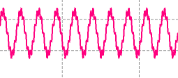
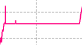
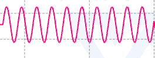
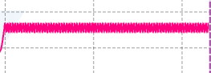
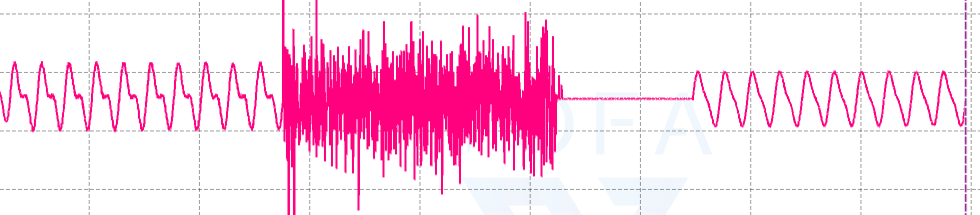
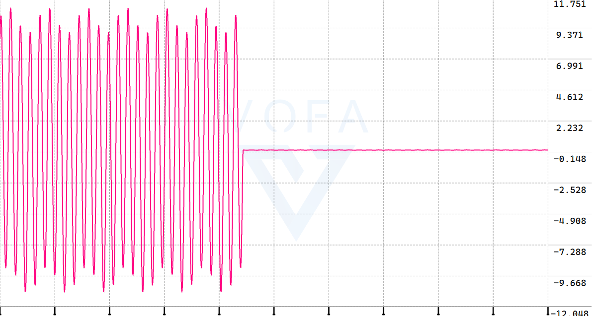
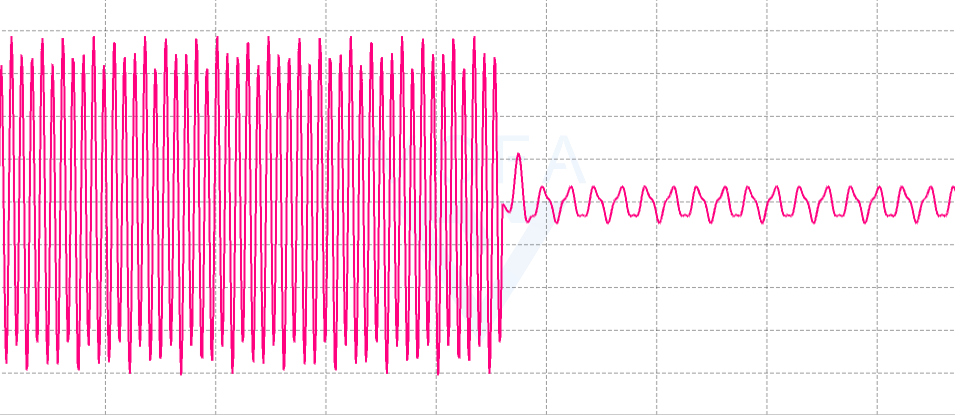
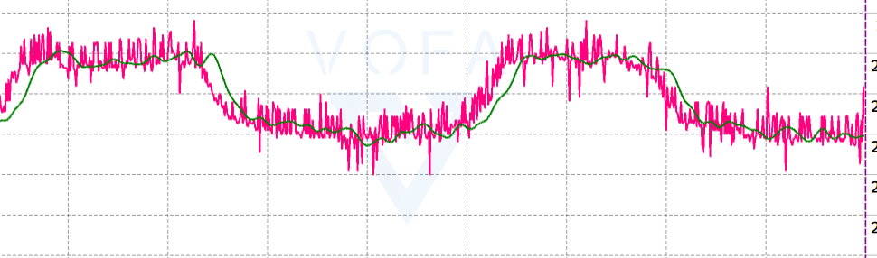

### 一.信号与系统的分析基础

### 二.信号的变换

1. **FFT**

   ~~~c
   
   #include "arm_const_structs.h"
   #define FFT_SIZE 1024 // FFT 的大小
   float32_t moni_data[FFT_SIZE]; // 模拟输入信号
   float32_t input[FFT_SIZE*2];  // 输入信号，有实部和虚部，所以*2
   float32_t output[FFT_SIZE/2]; // 输出信号
   void generate_signal(void) {
       // 1.生成示例输入信号（正弦波）
       for (int i = 0; i < FFT_SIZE; i++) {
           // 生成 10 Hz 正弦波和 80 Hz 余弦波
           moni_data[i] = 5*arm_sin_f32(2.0f * PI * 10.0f * i / 1024.0f) + arm_sin_f32(2.0f * PI * 80.0f * i / 1024.0f);
           // moni_data[i] = sin(2 * 3.14 * 50.0f / 1024.0f * i );
           printf("moni_data:%f\n",moni_data[i]);
       }
       // 2.数据预处理
       // 3.将浮点数切换为复数
       for(int i = 0;i < FFT_SIZE; i++)
       {
           input[2 * i] = moni_data[i];
           input[2 * i + 1] = 0;
       }
   
       
   }
   void process_fft(void) {
     // 4.执行 FFT
       arm_cfft_f32(&arm_cfft_sR_f32_len1024,input,0,1);
     // 5. 计算幅度谱
     arm_cmplx_mag_f32(input, output, FFT_SIZE/2);
     // 6. 归一化幅度谱
     for (int i = 0; i < FFT_SIZE / 2; i++) {
       output[i] /= (FFT_SIZE/2); // 归一化
     }
     for (int i = 0; i < FFT_SIZE/2; i++){
         printf("output:%f\n",output[i]);
     }
     for (int i = 0; i < FFT_SIZE; i++){
         printf("10:%f\n",output[10]*arm_sin_f32(2.0f * PI * 10.0f * i / 1024.0f));
     }
     for (int i = 0; i < FFT_SIZE; i++){
         printf("80:%f\n",output[80]*arm_sin_f32(2.0f * PI * 80.0f * i / 1024.0f));
     }
   
   }
   ~~~

   效果

   

**2.反FFT**

~~~c
// 只保留10hz的信号
#define FFT_SIZE 1024
float32_t moni_data[FFT_SIZE];
float32_t input_data[FFT_SIZE * 2];
float32_t output_data[FFT_SIZE / 2];
float32_t phase_data[FFT_SIZE];

void fft_test() {
    for (int i = 0; i < FFT_SIZE; i++) {
        // 生成 10 Hz 正弦波和 80 Hz 余弦波
        moni_data[i] = 5*sin(2.0f * PI * 10.0f * i / 1024.0f) + 3*sin(2.0f * PI * 20.0f * i / 1024.0f) + (float32_t)rand()/(float32_t)RAND_MAX;
        // moni_data[i] = sin(2 * 3.14 * 50.0f / 1024.0f * i );
        printf("moni_data:%f\n",moni_data[i]);
    }
    for (int i = 0; i < FFT_SIZE; i++)
    {
      input_data[i * 2] = moni_data[i];
      input_data[i * 2 + 1] = 0;
    }
    arm_cfft_f32(&arm_cfft_sR_f32_len1024, input_data, 0,1);
    
    for (int i = 0; i < FFT_SIZE; i++)
    {
      printf("%f\n", input_data[i]);
    }
    
    arm_cmplx_mag_f32(input_data, output_data, FFT_SIZE / 2);
    for (int i = 0; i < FFT_SIZE/2; i++)
    {
      printf("%f\n", output_data[i]/512.0f);
    }

    

    // 滤除 20 Hz 的频率分量
    float32_t fs = 1024.0f; // 采样频率
    float32_t target_freq = 10.0f; // 目标频率
    int target_bin = (int)(target_freq / (fs / FFT_SIZE)); // 计算目标频率对应的频率索引

    // 将目标频率的幅度和相位设置为零
    for (int i = 0; i < FFT_SIZE; i++)
    {
      if (i == (target_bin * 2) || i == ((FFT_SIZE - target_bin) * 2) || i == (target_bin * 2 + 1) || i == ((FFT_SIZE - target_bin) * 2 + 1))
      {
        continue;
      }
      input_data[i] = 0;
    }
    
    

    
    arm_cfft_f32(&arm_cfft_sR_f32_len1024, input_data, 1,1);
    for (int i = 0; i < FFT_SIZE; i++)
    {
      printf("%f\n", input_data[i*2]);
    }
    
}

~~~

### 三.IIR（无限冲击响应）滤波器的设计 

- **描述**：具有反馈结构的数字滤波器，能够实现更高的滤波性能。

- **实现**：通过设计适当的递归系数来实现滤波。

  ~~~c
  #define NUM_TAPS_IIR 7  // 滤波器系数数量
  // 定义 IIR 滤波器系数（示例系数，需根据设计计算）
  float32_t iirCoeffs[NUM_TAPS_IIR] = {
       0.00065395f,  0.f,-0.00196184f,0.f,0.00196184f,  0.f,-0.00065395  // 这里的系数需要根据设计进行调整
  };
  // 定义 IIR 滤波器状态
  float32_t iirState[NUM_TAPS_IIR];
  // 创建 IIR 滤波器实例
  arm_biquad_casd_df1_inst_f32 iirInstance = {0};
  float32_t iirInput[1024]; // 输入信号
  float32_t iirOutput[1024]; // 输出信号
  void test_iir(){
      // 初始化 IIR 滤波器
      arm_biquad_cascade_df1_init_f32(&iirInstance, 1, iirCoeffs, iirState);  
      for (int i = 0; i < 1024; i++) {
          // 生成 40 Hz 正弦波和 10 Hz 余弦波
          iirInput[i] =  ((10*arm_sin_f32(2.0f * PI * 40.0f * i / 1024.0f)) + arm_cos_f32(2.0f * PI * 10.0f  * i / 1024.0f));
          printf("iirInput:%f\n",iirInput[i]);
          // 处理输入信号
          arm_biquad_cascade_df1_f32(&iirInstance, &iirInput[i], &iirOutput[i], 1);
      }
      for (int i = 0; i < 1024; i++) {
          printf("iirOutput:%f\n",iirOutput[i]);
      }
  }
  ~~~

  ~~~python
  from scipy.signal import butter
  
  # 定义滤波器参数
  order = 2  # 滤波器阶数
  lowcut = 30 / (1024/2)   # 通带下限（归一化频率=频率/（采样率/2）)
  highcut = 50 / (1024/2)  # 通带上限（归一化频率=频率/（采样率/2）)
  
  # 计算 IIR 滤波器系数
  b, a = butter(order, [lowcut, highcut], btype='band')
  
  # 打印 IIR 滤波器系数
  print("IIR 滤波器系数 (b):", b)
  print("IIR 滤波器系数 (a):", a)
  
  ~~~

  滤波效果

  

### 四.FIR（有限冲击响应）滤波器的设计

- **描述**：一种常见的数字滤波器，具有线性相位特性。

- **实现**：通过设计适当的系数来实现低通、高通、带通等滤波。

  ~~~c
  // 带通滤波算法的实现
  #define NUM_TAPS 32 // 滤波器系数的数量
  float32_t firCoeffs[NUM_TAPS] = {
      // 这里填入您的 FIR 系数
    -0.0067905,  -0.00810914, -0.01080181, -0.01440566, -0.01790443, -0.0198824,
   -0.01879344, -0.01329515, -0.00258022,  0.01336665,  0.03364645,  0.05649336,
    0.07949347,  0.09994131,  0.11527114,  0.12348308,  0.12348308,  0.11527114,
    0.09994131,  0.07949347,  0.05649336,  0.03364645,  0.01336665, -0.00258022,
   -0.01329515, -0.01879344, -0.0198824 , -0.01790443, -0.01440566, -0.01080181,
   -0.00810914, -0.0067905
  };
  float32_t firState[NUM_TAPS + 1]; // 状态缓冲区
  float32_t firInput[1024]; // 输入信号
  float32_t firOutput[1024]; // 输出信号
  // FIR 滤波器实例
  arm_fir_instance_f32 firInstance;
  void test_fir(){
      // 模拟输入
      arm_fir_init_f32(&firInstance, NUM_TAPS, firCoeffs, firState, 0);
      for (int i = 0; i < 1024; i++) {
          // 生成 40 Hz 正弦波和 10 Hz 余弦波
          firInput[i] =  ((10*arm_sin_f32(2.0f * PI * 40.0f * i / 1024.0f)) + arm_cos_f32(2.0f * PI * 10.0f  * i / 1024.0f));
          printf("firInput:%f\n",firInput[i]);
          arm_fir_f32(&firInstance, &firInput[i], &firOutput[i], 1);
      }
      for (int i = 0; i < 1024; i++) {
          printf("firOutput:%f\n",firOutput[i]);
      }
  }
  ~~~

  ~~~python
  #用python生成滤波阶数和FIR系数
  from scipy.signal import firwin
  
  # 设计带通滤波器
  num_taps = 32  # 滤波器系数数量
  # 假设您的采样频率为 1000 Hz，那么奈奎斯特频率为 500 Hz。以下是一些频率的归一化示例：
  # 100 Hz 的归一化频率 = 100 / 500 = 0.2
  lowcut = 20 / (1024/2)   # 通带下限（归一化频率=频率/（采样率/2）)
  highcut = 50 / (1024/2)  # 通带上限（归一化频率=频率/（采样率/2）)
  
  # 计算 FIR 系数
  fir_coeffs = firwin(num_taps, [lowcut, highcut], pass_zero=False)
  
  print(fir_coeffs)
  c_array = '{' + ', '.join(map(str, fir_coeffs)) + '}'
  print(c_array)
  ~~~

  滤波效果

  

  ~~~c
  #define NUM_TAPS 32 // 滤波器系数的数量
  float32_t firCoeffs[NUM_TAPS] ={-0.0005270884559394201, 0.0005925177564564345, 0.0022281034733202154, 0.004130944115003111, 0.004982898320009407, 0.0027376073230155574, -0.004039169716202642, -0.014437044977244027, -0.024176104402519345, -0.026262652950450233, -0.013516386747835094, 0.01790972571484416, 0.06565841882594353, 0.12055556446244713, 0.16895359273799876, 0.19733838487136643, 0.19733838487136643, 0.16895359273799876, 0.12055556446244713, 0.06565841882594353, 0.017909725714844157, -0.013516386747835089, -0.026262652950450233, -0.024176104402519338, -0.014437044977244023, -0.00403916971620264, 0.0027376073230155574, 0.004982898320009407, 0.004130944115003111, 0.0022281034733202154, 0.0005925177564564345, -0.0005270884559394201};
  // FIR 滤波器实例
  arm_fir_instance_f32 firInstance;
  float32_t firInput; // 输入信号
  float32_t firOutput; // 输出信号
  float32_t firState[NUM_TAPS + 1]; // 状态缓冲区
  
  while (1)
    {
      float32_t  start_time = HAL_GetTick();
      HAL_Delay(10);
      HAL_ADC_Start(&hadc3);
      firInput = HAL_ADC_GetValue(&hadc3);
      // HAL_ADC_Stop(&hadc3); // 停止ADC
      arm_fir_f32(&firInstance, &firInput, &firOutput, 1);
      printf("%f,%f\n", firInput,firOutput);
      float32_t  end_time = HAL_GetTick();
              // 计算转换时间（毫秒）
      float conversion_time = (end_time - start_time) / 1000.0f;
      //         // 计算采样率
      if (conversion_time > 0) {
          float32_t sampling_rate = 1.0f / conversion_time;
          printf("Sampling Rate: %f Hz\n", sampling_rate);
      }
    }
  ~~~

  ~~~python
  #用python生成滤波阶数和FIR系数
  from scipy.signal import firwin
  
  # 设计带通滤波器
  num_taps = 32  # 滤波器系数数量( 32 到 128 之间)
  # 假设您的采样频率为 1000 Hz，那么奈奎斯特频率为 500 Hz。以下是一些频率的归一化示例：
  # 100 Hz 的归一化频率 = 100 / 500 = 0.2
  sampling_rate =  50 # 采样率
  rate_min = 0.005
  rate_max = 5.0
  lowcut = rate_min / (sampling_rate/2)   # 通带下限（归一化频率=频率/（采样率/2）)
  highcut = rate_max / (sampling_rate/2)  # 通带上限（归一化频率=频率/（采样率/2）)
  
  # 计算 FIR 系数
  fir_coeffs = firwin(num_taps, [lowcut, highcut], pass_zero=False)
  c_array = '{' + ', '.join(map(str, fir_coeffs)) + '}'
  print(c_array)
  
  ~~~

  

  

### 五.其他滤波器

##### 1.维纳滤波器

##### 2.**卡尔曼滤波**

- **描述**：一种基于状态空间模型的滤波算法，能够估计系统状态并减小噪声影响。

- **实现**：适用于线性系统和高斯噪声，常用于导航和定位。

  ~~~c
  // 
  
  typedef struct {
      float E_est_last; // 上次估计误差
      float E_est_now; // 当前估计误差
      float E_mea; // 测量误差
      float Data_last_Predict; // 上次估计值
      float Data_Current_Predict; // 当前估计值
      float Data_Curent_Measure; // 当前测量值
      float K; // Kalman增益系数
      
  }KalmanFilter;
  
  float Kalman_Init(KalmanFilter * kf,) {
      // 第一步：计算Kalman Gain
      kf->K = kf->E_est_last/(E_est_last +E_mea);
      // 第二步：计算当前估计值
      kf->Data_Current_Predict = kf->K+(kf->Data_Curent_Measure-Data_last_Predict);
      // 第三步：更新E_est
      kf->E_est_now = (1-kf->K)E_est_last
      return ;
  }
  ~~~

  

  ~~~c
  #include <stdio.h>
  
  // 定义卡尔曼滤波器结构体
  typedef struct {
      float Q; // 过程噪声协方差,Q越大滤波器更加依赖于新的测量数据而非模型预测
      float R; // 测量噪声协方差，实际测量值与真实值之间的误差，R越大滤波器会更倾向于信任模型预测而非测量数据
      float x; // 估计值
      float P; // 估计误差协方差，波器对当前状态估计的自信程度的度量，P越大意味着当前的估计值不太可靠
      float K; // 卡尔曼增益，如果K值较大，新的测量值对最终估计的影响更大
  } KalmanFilter;
  
  // 初始化卡尔曼滤波器
  void KalmanFilter_Init(KalmanFilter *kf, float Q, float R, float initial_value) {
      kf->Q = Q;
      kf->R = R;
      kf->x = initial_value;
      kf->P = 1.0;
      kf->K = 0.0;
  }
  
  // 更新卡尔曼滤波器
  float KalmanFilter_Update(KalmanFilter *kf, float measurement) {
      // 预测更新
      kf->P = kf->P + kf->Q;
  
      // 计算卡尔曼增益
      kf->K = kf->P / (kf->P + kf->R);
  
      // 更新估计值
      kf->x = kf->x + kf->K * (measurement - kf->x);
  
      // 更新估计误差协方差
      kf->P = (1 - kf->K) * kf->P;
  
      return kf->x;
  }
  
  int main() {
      // 创建并初始化卡尔曼滤波器
      KalmanFilter kf;
      KalmanFilter_Init(&kf, 0.1, 0.1, 0.0);
  
      // 模拟测量数据
      float measurements[10] = {1.0, 2.0, 3.0, 2.5, 3.5, 3.0, 4.0, 5.0, 4.5, 5.5};
  
      // 使用卡尔曼滤波器处理测量数据
      for (int i = 0; i < 10; i++) {
          float estimate = KalmanFilter_Update(&kf, measurements[i]);
          printf("Measurement: %f, Estimate: %f\n", measurements[i], estimate);
      }
  
      return 0;
  }
  ~~~

  

##### 3.自适应滤波器

- **描述**：根据输入信号的特性动态调整滤波器参数。
- **实现**：常用的算法包括 LMS（最小均方）和 RLS（递归最小二乘）。

##### 4.lattice滤波器

##### 5.线性预测滤波器

##### 6.**互补滤波**

- **描述**：结合高通和低通滤波器，常用于传感器融合（如 IMU 数据融合）。
- **实现**：通过加权平均来平衡短期和长期信号。

##### 7.中值滤波

- **描述**：一种非线性滤波方法，能够有效去除脉冲噪声。
- **实现**：通过取窗口内数据的中值来平滑信号。

### 六.随机信号处理基础

### 七.小波在信号处理中的应用

### 八.语音信号实战

### 九.通信信号实战

### 十.雷达信号实战

### 十一.控制算法

1. **PID 控制**

   - **描述**：比例-积分-微分控制器（PID）是最常见的控制算法之一，广泛应用于温度控制、速度控制等。

   - **实现**：通过调整比例、积分和微分系数来优化系统响应。

     ~~~c
     ,ARM_MATH_CM3
     #include "arm_math.h"
     arm_pid_instance_f32 pid;  // PID 实例
     void test_pid_control_setup() {
       pid.Kp = 1.0f;        // 比例增益，当前，根据经验
       pid.Ki = 0.5f;        // 积分增益，过去，3-5次接近静态误差即可
       pid.Kd = 0.1f;        // 微分增益，未来，当出现小幅震荡时减小30%
       arm_pid_init_f32(&pid, 1);  // 初始化 PID，1 表示是否启用积分
     }
     
     void test_pid_control_loop(float setpoint, float input) {
       float32_t output = arm_pid_f32(&pid, setpoint-input);
       printf("output: %f\n", output);
     }
     ~~~
     
     

2. **模糊控制**

   - **描述**：基于模糊逻辑的控制方法，适用于不确定性较高的系统。
   - **实现**：使用模糊规则和推理机制来进行控制决策。

3. **状态空间控制**

   - **描述**：通过状态空间模型描述系统动态，适用于多输入多输出（MIMO）系统。
   - **实现**：使用状态反馈和观测器设计来控制系统。

4. **自适应控制**

   - **描述**：能够根据系统的变化自动调整控制参数。
   - **实现**：使用算法（如模型参考自适应控制）来实时更新控制参数。

5. **滑模控制**

   - **描述**：一种鲁棒控制方法，适用于非线性系统。
   - **实现**：通过设计滑模面和控制律来实现系统的跟踪和稳定。

6. **最优控制**

   - **描述**：通过优化某个性能指标（如最小能耗、最小时间）来设计控制策略。
   - **实现**：常用的算法包括线性二次调节器（LQR）。

